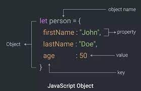
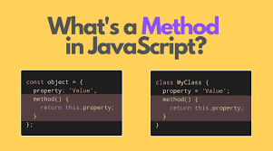

# Lecture5-April
# Homework
## _Object_
[
### JavaScript object is a nonprimitive data-type that allows you to store multiple collections of data.


## _`Object methods javascript:`_ 
[
- # `Object.entries()`

> The Object.entries() method returns an array of a given
object's own enumerable string-keyed property [key,
value] pairs.

```
const object1 = {
  a: 'somestring',
  b: 42
};

for (const [key, value] of Object.entries(object1)) {
  console.log(`${key}: ${value}`);
}

// Expected output:
// "a: somestring"
// "b: 42"
```
- #  `Object.keys()`
 > The Object.keys() method returns an array of a given
object's own enumerable property names, iterated in
the same order that a normal loop would.
```
const object1 = {
  a: 'somestring',
  b: 42,
  c: false
};

console.log(Object.keys(object1));
// Expected output: Array ["a", "b", "c"]
```

- # `Object.values()`

[
 >The Object.values() method returns an array of a given
object's own enumerable property values.
```
const object1 = {
  a: 'somestring',
  b: 42,
  c: false
};

console.log(Object.values(object1));
// Expected output: Array ["somestring", 42, false]
```

## _`Destructuring`_

### The destructuring assignment syntax is a JavaScript expression that makes it possible to unpack properties from object, into distinct variables.
```
const { a, b } = obj;
const { a: a1, b: b1 } = obj;
const { a: a1 = aDefault, b = bDefault } = obj;
const { a, b, ...rest } = obj;
const { a: a1, b: b1, ...rest } = obj;
const { [key]: a } = obj;
```


## _`Spread`_

### The spread operator ... is used to expand or spread an to make it works with own enumerable properties of an object. 
```
const circle = {
    radius: 10
};
const coloredCircle = {
    ...circle,
    color: 'black'
};

console.log(coloredCircle);

Output:


{
    radius: 10,
    color: 'black'
}
```


## _`This`_

### this is not a variable. It is a keyword.
### You cannot change the value of this.

```
const test = {
  prop: 42,
  func: function() {
    return this.prop;
  },
};

console.log(test.func());
// Expected output: 42
```
# _`This in a Method`_
### When used in an object method, this refers to the object.In the example on top of this page, this refers to the person object. Because the fullName method is a method of the person object.


# _`This in a Function (Default)`_
### What is the default function?
### A function default value is a value that can be used for a parameter if the calling statement does not pass an argument. If an argument is provided, the default value is ignored.


## _`Date and Time`_


### In JavaScript, date and time are represented by the Date object. The Date object
### provides the date and time information and also provides various methods.
### A JavaScript date defines the EcmaScript epoch that represents milliseconds
### since 1 January 1970 UTC. This date and time is the same as the UNIX epoch
### (predominant base value for computer-recorded date and time values).

## _`Creating Date Objects`_
# There are four ways to create a date object.

- ## New Date()

- ## New Date(milliseconds)

- ## New Date(Date string)

- ## New Date(year, month, day, hours, minutes, seconds, milliseconds)
----------------------------------------------------------------------------
## _`New Date()`_


##  _`New Date(milliseconds)`_
.png)

##  _`New Date(year, month, day, hours, minutes, seconds, milliseconds)`_
.png))


# Date Methods

- ### Date.now()
> Date.now() returns the number of milliseconds since January 1, 1970.
```
// This example takes 2 seconds to run
const start = Date.now();

console.log('starting timer...');
// Expected output: "starting timer..."

setTimeout(() => {
  const millis = Date.now() - start;

  console.log(`seconds elapsed = ${Math.floor(millis / 1000)}`);
  // Expected output: "seconds elapsed = 2"
}, 2000);
```

- ### GetFullYear()
> GetFullYear() returns the full year of a date (4 digits).
```
const moonLanding = new Date('July 20, 69 00:20:18');

console.log(moonLanding.getFullYear());
// Expected output: 1969
```

- ### getMonth()
> GetMonth() returns the month (0 to 11) of the date. January = 0, February = 1, ..
```
const moonLanding = new Date('July 20, 69 00:20:18');

console.log(moonLanding.getMonth()); // (January gives 0)
// Expected output: 6
```

- ### getDate()
> The getDate() method returns the day of the month (1 to 31) of the date.
```
const birthday = new Date('August 19, 1975 23:15:30');
const date1 = birthday.getDate();

console.log(date1);
// Expected output: 19
```

- ### getDay()
> The getDay() method returns the day of the week (0 to 6) of the date. Sunday = 0, Monday = 1, 
```
const birthday = new Date('August 19, 1975 23:15:30');
const day1 = birthday.getDay();
// Sunday - Saturday : 0 - 6

console.log(day1);
// Expected output: 2
```

- ### GetHours()
> getHours() returns the hours (0 to 23) of a date.
```
const birthday = new Date('March 13, 08 04:20');

console.log(birthday.getHours());
// Expected output: 4
```

- ### GetMinutes
> getMinutes() returns the minutes (0 to 59) of a date.
```
const birthday = new Date('March 13, 08 04:20');

console.log(birthday.getMinutes());
// Expected output: 20
```


- ### setFullYear()
>   setFullYear() sets the year of the date.
setFullYear() can also set the month and day 
```
const event = new Date('August 19, 1975 23:15:30');

event.setFullYear(1969);

console.log(event.getFullYear());
// Expected output: 1969

event.setFullYear(0);

console.log(event.getFullYear());
// Expected output: 0
```

- ### setMonth()
>   The setMonth() method sets the month of the date object.
This method can also be used to set the day of the month.
```
const event = new Date('August 19, 1975 23:15:30');

event.setMonth(3);

console.log(event.getMonth());
// Expected output: 3

console.log(event);
// Expected output: "Sat Apr 19 1975 23:15:30 GMT+0100 (CET)"
// Note: your timezone may vary
```

- ### setDate()
>setDate() sets the day month of the date.
```
const event = new Date('August 19, 1975 23:15:30');

event.setDate(24);

console.log(event.getDate());
// Expected output: 24

event.setDate(32);
// Only 31 days in August!

console.log(event.getDate());
// Expected output: 1
```


